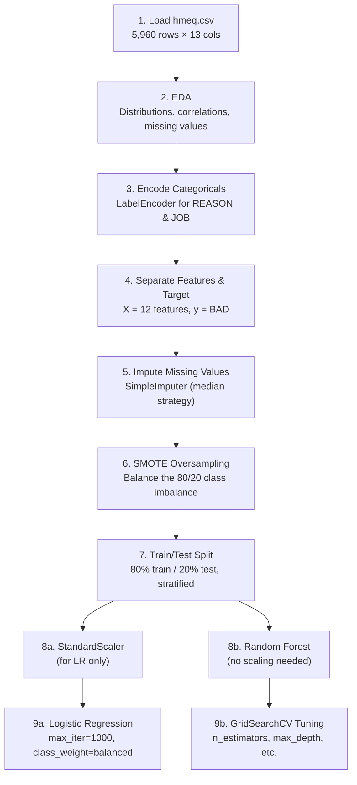
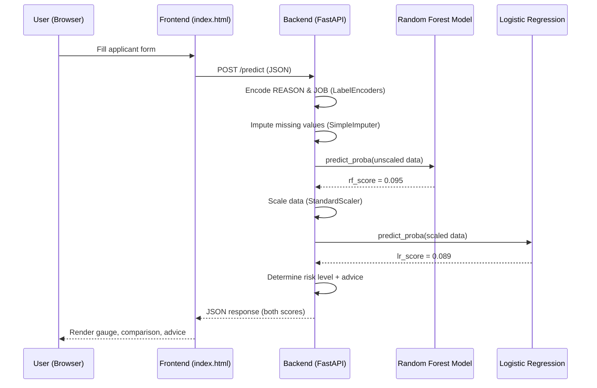

# CreditIQ — ML Training & Model Comparison Guide

> Use this guide to explain the full ML pipeline during your demo.

---

## 1. Dataset — HMEQ (Home Equity)

**Source:** [Kaggle — HMEQ Dataset](https://www.kaggle.com/datasets/ajay1735/hmeq-data)

| Property | Value |
|---|---|
| **Rows** | 5,960 loan applications |
| **Target** | `BAD` — 1 = defaulted, 0 = did not default |
| **Default rate** | ~20% (imbalanced) |
| **Features** | 12 (10 numerical + 2 categorical) |

### Feature Descriptions

| Feature | Type | Description |
|---|---|---|
| `LOAN` | Numeric | Loan amount requested (USD) |
| `MORTDUE` | Numeric | Amount due on existing mortgage |
| `VALUE` | Numeric | Current property value |
| `REASON` | Categorical | Loan purpose — `HomeImp` (home improvement) or `DebtCon` (debt consolidation) |
| `JOB` | Categorical | Job category — Mgr, Office, ProfExe, Sales, Self, Other |
| `YOJ` | Numeric | Years at current job |
| `DEROG` | Numeric | Number of major derogatory reports (bankruptcies, repossessions) |
| `DELINQ` | Numeric | Number of delinquent credit lines (missed payments) |
| `CLAGE` | Numeric | Age of oldest credit line (months) |
| `NINQ` | Numeric | Number of recent credit inquiries |
| `CLNO` | Numeric | Number of existing credit lines |
| `DEBTINC` | Numeric | Debt-to-income ratio (%) |

---

## 2. Training Pipeline



### Step-by-step Explanation

#### Step 1–2: Load & Explore
- Loaded the HMEQ CSV from Kaggle
- EDA revealed: ~20% default rate (imbalanced), significant missing values in `DEBTINC` (21.3%), `MORTDUE`, `VALUE`, and `DEROG`
- Correlation heatmap showed `DELINQ`, `DEROG`, and `DEBTINC` are the strongest predictors of default

#### Step 3: Encode Categoricals
- `REASON` (HomeImp=1, DebtCon=0) and `JOB` (6 categories → 0–5) encoded using `LabelEncoder`
- These encoders are saved as `le_reason.pkl` and `le_job.pkl` for the web app

#### Step 4–5: Imputation
- Used `SimpleImputer(strategy='median')` — median is robust against outliers
- Saved as `imputer.pkl` for consistent preprocessing in the web app

#### Step 6: SMOTE (Synthetic Minority Over-sampling Technique)
- Original: ~4,700 non-defaults vs ~1,200 defaults (4:1 imbalance)
- After SMOTE: Equal classes — the algorithm generates synthetic examples of the minority class
- **Why?** Without this, models would just predict "not default" for everything and still get 80% accuracy

#### Step 7: Train/Test Split
- 80% training, 20% testing
- `stratify=y_resampled` ensures both sets have the same class ratio
- `random_state=42` for reproducibility

#### Step 8–9: Model Training

**Logistic Regression** — trained on **scaled** data:
- StandardScaler normalizes features to mean=0, std=1
- LR needs this because it's sensitive to feature magnitude
- `class_weight='balanced'` further addresses any residual imbalance

**Random Forest** — trained on **unscaled** data:
- Tree-based models don't need scaling (they split on thresholds, not distances)
- Initial model with default hyperparameters, then tuned with GridSearchCV

---

## 3. Model Comparison Results

### Performance Metrics

| Metric | Logistic Regression | Random Forest (Default) | Random Forest (Tuned) ✅ |
|---|---|---|---|
| **Accuracy** | 73.13% | 95.02% | **94.92%** |
| **Precision** | 76.92% | 96.33% | **96.03%** |
| **Recall** | 66.04% | 93.61% | **93.71%** |
| **F1-Score** | 71.07% | 94.95% | **94.85%** |
| **ROC-AUC** | 0.8198 | 0.9899 | **0.9904** ✅ |

> [!IMPORTANT]
> **Best model: Random Forest (Tuned)** — selected by highest ROC-AUC score (0.9904). This is the model used in the CreditIQ web app.

### Understanding the Metrics

| Metric | What it Means | Why it Matters for Credit Risk |
|---|---|---|
| **Accuracy** | % of all predictions that were correct | Overall correctness, but can be misleading with imbalanced data |
| **Precision** | Of all predicted defaults, how many actually defaulted? | Prevents incorrectly rejecting good applicants |
| **Recall** | Of all actual defaults, how many did we catch? | **Critical** — missing a default = bank loses money |
| **F1-Score** | Harmonic mean of Precision & Recall | Balances both errors |
| **ROC-AUC** | Area Under the ROC Curve (0.5 = random, 1.0 = perfect) | Best single metric for comparing classifiers |

### Why Random Forest Won

1. **Non-linear relationships** — Debt risk depends on complex interactions (e.g., high delinquency + high debt-to-income is much worse than either alone). RF captures this; LR assumes linear relationships.
2. **Ensemble power** — RF uses 200 decision trees and votes on the majority. Individual tree mistakes are averaged out.
3. **Feature interactions** — RF naturally handles feature combinations without explicit feature engineering.

### Why We Still Keep Logistic Regression

- **Interpretability** — In banking, regulators may require explainable models. LR coefficients show exactly how each feature affects the prediction.
- **Baseline comparison** — Shows the improvement from using a more complex model.
- **Speed** — LR is much faster for real-time predictions (though RF is fast enough for this use case).

---

## 4. Feature Importance (Random Forest)

The tuned Random Forest ranks features by how much they reduce impurity across all trees:

| Rank | Feature | Importance | Interpretation |
|---|---|---|---|
| 🥇 1 | **DELINQ** | 18.6% | Missed payments = strongest default signal |
| 🥈 2 | **DEBTINC** | 15.2% | High debt-to-income = higher risk |
| 🥉 3 | **DEROG** | 10.2% | Bankruptcies/repossessions = past failures |
| 4 | NINQ | 9.6% | Many recent credit applications = risky |
| 5 | CLAGE | 8.2% | Short credit history = less trustworthy |
| 6 | VALUE | 6.7% | Lower property value = less collateral |
| 7 | LOAN | 6.2% | Larger loans = higher risk |
| 8 | MORTDUE | 6.1% | Higher existing mortgage = more leveraged |
| 9 | CLNO | 5.6% | Fewer credit lines = less experience |
| 10 | YOJ | 5.3% | Less job tenure = less stability |
| 11 | JOB | 4.4% | Job type has some predictive value |
| 12 | REASON | 4.1% | Loan purpose has minimal impact |

> [!TIP]
> **Demo talking point:** "The model tells us that a borrower's payment history (delinquencies, derogatory reports) and financial leverage (debt-to-income ratio) are far more important than their job type or loan reason in predicting default."

---

## 5. Hyperparameter Tuning (GridSearchCV)

GridSearchCV tested 72 parameter combinations (3 × 3 × 2 × 2 × 2) with 5-fold cross-validation:

```python
param_grid = {
    'n_estimators':      [50, 100, 200],   # number of trees
    'max_depth':         [None, 5, 10],     # max tree depth
    'min_samples_split': [2, 5],            # min samples to split
    'min_samples_leaf':  [1, 2]             # min samples per leaf
}
```

**Best parameters found:**
- The tuned model achieved ROC-AUC 0.9904 (vs 0.9899 for untuned)
- Marginal improvement because the default RF was already strong
- But the tuning process validates that we've exhausted optimization opportunities

---

## 6. Web App Architecture



### Decision Logic

| RF Probability | Risk Level | Decision | Color |
|---|---|---|---|
| < 30% | Low Risk | ✅ APPROVE | Green |
| 30% – 60% | Medium Risk | ⚠️ CONDITIONAL | Amber |
| > 60% | High Risk | ❌ DECLINE | Red |

---

## 7. Demo Script

### Show Low Risk Applicant
> "This applicant has a stable 7-year job as a Manager, no delinquencies, no derogatory marks, and a healthy 25% debt-to-income ratio. Both models agree — 9.5% default probability. The Random Forest is our primary model with 0.99 AUC."

### Show High Risk Applicant
> "Now let's change to a risky profile — Self-employed for just 1 year, 5 missed payments, 3 derogatory reports, and a 72% debt-to-income ratio. Watch how the risk score jumps and the model recommends DECLINE."

### Explain the Model Comparison
> "We trained both Logistic Regression and Random Forest. The RF achieved 95% accuracy and 0.99 AUC compared to LR's 73% and 0.82. The BEST badge shows which model is more confident for each specific applicant. We use the RF as the primary decision model because it captures complex feature interactions that LR misses."
